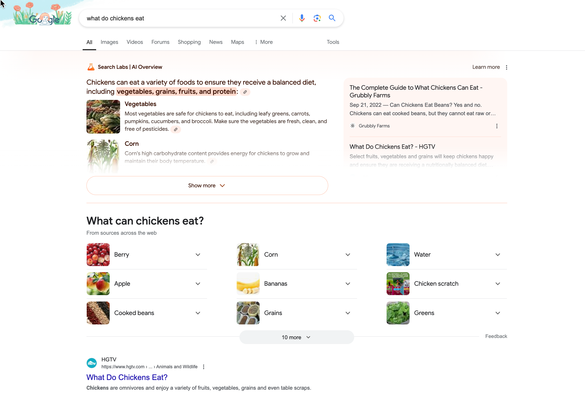
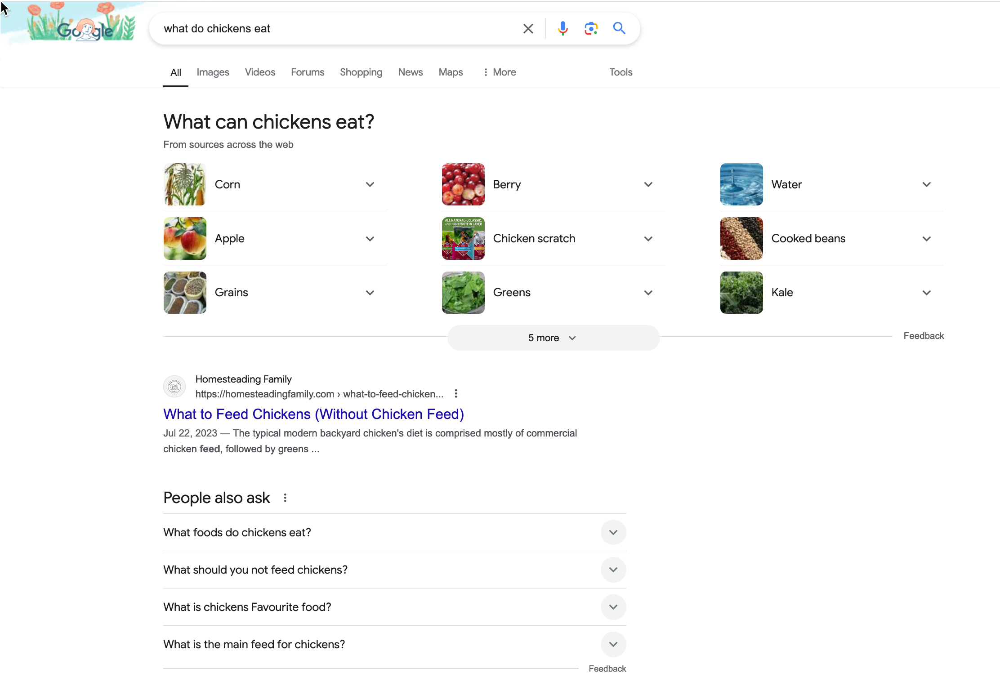
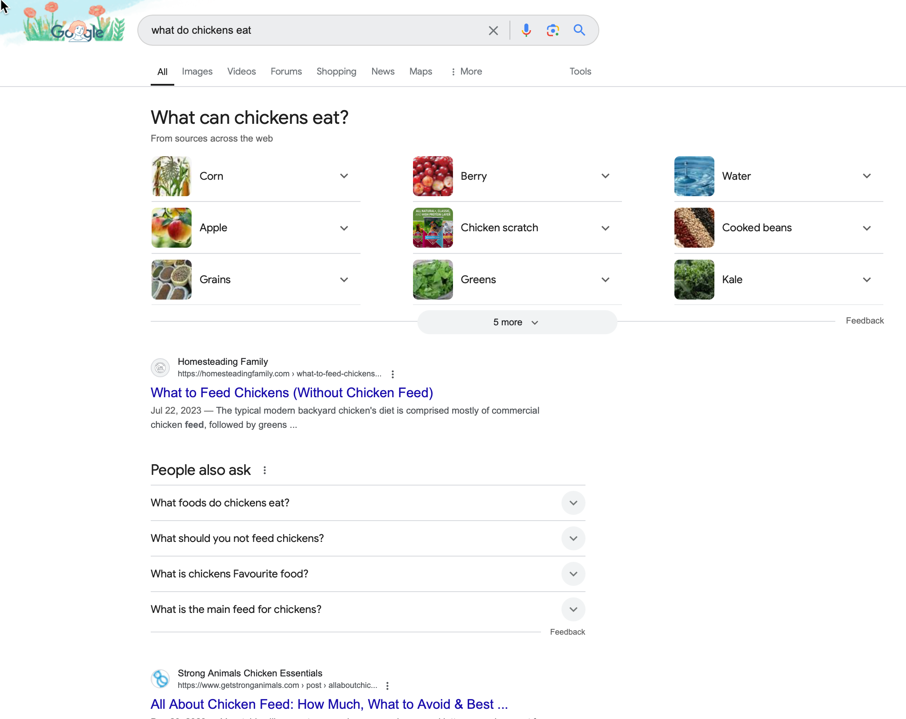
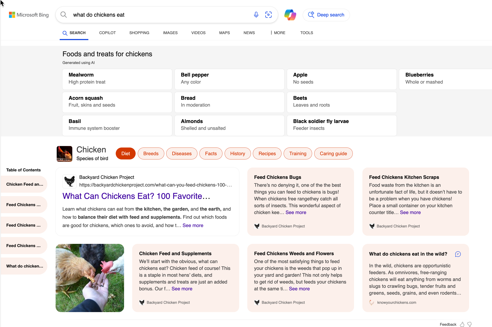

# Interacting with GAI

<figure><figcaption>
Interacting with Artificial Intelligence
</figcaption></figure>

### From Search Engine to AI Overview

Interacting with AI using web applications is similar to Googling.  Google allows you to type your search prompt into the address bar.  It returns a list of links you can click to find more information related to your search prompt.  In 2024, Google started adding AI overviews to the search results.   If you type a search prompt in Safari or Firefox, a Google search will be run, and the results will look the same as they do in Google.

<figure><figcaption>
Google Search on Google
</figcaption></figure>

 

<figure><figcaption>
Google Search on Safari
</figcaption></figure>

 

<figure><figcaption>
Google Search on Firefox
</figcaption></figure>

Microsoft Edge started using its Bing search engine to return AI overviews in 2023.

<figure><figcaption>
Microsoft Edge 
</figcaption></figure>

In the past few years, the growth of AI has influenced the browser search experience. This paves the way for interacting with different models directly.  The models we'll experiment with in the course each have their user interface served up in a web-based or mobile application.

### AI Models

There are many AI models available. We'll use free models. However, the free accounts they provide may have limits. For example, ChatGPT has a two-image per day limit. Creating images, video, and audio tends to have stricter limits because they require more processing.  Most of the interactions in this course will focus on text because we seek help with problem-solving through dialog.&#x20;

Click on each link, and you'll be prompted to log in to create a free account.&#x20;

| Model                                             | Media Type   | Owner     |
| ------------------------------------------------- | ------------ | --------- |
| [Gemini](https://gemini.google.com/)              | Text         | Google    |
| [ChatGPT](https://chatgpt.com/)                   | Text, Images | Open AI   |
| [Claude.ai](https://claude.ai/)                   | Text         | Anthropic |
| [Speechify Studio](https://studio.speechify.com/) | Audio, Video | Speechify |
| [Grammarly](https://www.grammarly.com/)           | Text Editing | Grammarly |

