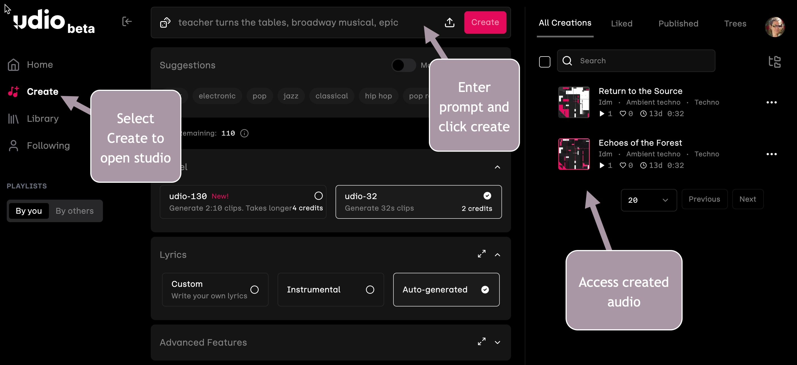

# Model Interfaces

<figure><figcaption>
User Interfaces
</figcaption></figure>

The user experience with each of these models is unique. The text-based models have similar interfaces, but Grammarly and Speechify Studio models use very different interfaces.

Note that user interfaces evolve quickly, and the images shown for each model may not reflect the current interface.

### Gemini

Google Gemini is a GenAI free online assistant that can help you learn and create new content.  It is accessible from a laptop or mobile device.  It is accessible on the web at this location: [https://gemini.google.com/](https://gemini.google.com/).

The Gemini user interface provides some sample prompts, an input box to add your prompt and a list of prompts you previously submitted.  You can click on the previous prompts to view Gemini's response.

<figure><figcaption>
Gemini User Interface
</figcaption></figure>

### ChatGPT

ChatGPT provides a free plan to use AI to create content using prompts.  You can access ChatGPT on the web at [https://chatgpt.com/](https://chatgpt.com/).  ChatGPT can generate images, but limits the number to two per day for the free plan.

ChatGPT's user interface is similar to Gemini's. It includes a section for sample prompts, an input box to add your prompt and a list of prompts you previously submitted.

<figure><figcaption>
ChatGPT User Interface
</figcaption></figure>

### Claude.ai

Claude.ai provides similar content creation to Gemini.  The web address is [claude.ai](https://claude.ai/). &#x20;

Like Gemini and ChatGPT, the user interface includes a section for sample prompts, an input box to add your prompt, and a list of prompts you previously submitted.  The design and layout is different as you can see in the image below.

<figure><figcaption></figcaption></figure>

### Udio

Udio is a music generator that creates audio from a text prompt. The Udio website shares the audio created. To get started, navigate to udio.com. Like LLMs that learn a language and develop algorithms from the patterns they detect, music generator models listen to music and create algorithms for the patterns they detect.

Like other GenAIs, Udio uses natural language processing to understand the prompt. It then uses the text in the prompt to understand musical sound and rhythm to create new music.

The user interface for Udio provides a Create option from the home page. Clicking Create on the left opens the studio, where you can enter a prompt and click another Create button to generate the music. The interface also stores audio created by earlier prompts.

<figure><figcaption>
Udio Music Generator
</figcaption></figure>

### Grammarly

When you need help with grammar and text editing, Grammarly is an AI product that can help. It is installed as a browser extension and can be found on the [Chrome Web Store](https://chromewebstore.google.com/detail/grammarly-ai-writing-and/kbfnbcaeplbcioakkpcpgfkobkghlhen).  Because it's a browser extension, it has access to web pages.  As you type into an input field on a web page, Grammarly comes alive to read your text and provide suggestions to improve it.  It's also good at finding typos.

Grammarly is also available as a Mac application and in the Android and iPhone app stores.

<figure><figcaption>
Grammarly Coming to Life on a Web Page as a Chrome Extensions
</figcaption></figure>

