# Using Edublogs to Share Work

<figure><figcaption>
should have an image of an illustrated chicken. If you hover over the image, there is a download button. Click on it to download the image. Make note of the name of the image youSignup for a free blog account
</figcaption></figure>

[Edublogs](https://edublogs.org/) is an online platform that hosts free blog websites for education.  A blob website is a collection of posts.  You can include text, images, and videos in your blog post.  &#x20;

Summarizing your sessions is essential to interacting with AI to solve problems.   A blog post is an excellent way to do this.  Your session notes can be as simple as a bullet list of what you asked and what you learned.  You can copy responses verbatim into your blog.  You can credit the AI used to create these responses if you do.

The Edublogs platform is built using a popular website platform named [Wordpress](https://wordpress.com/).  Edublog provides [help](https://help.edublogs.org/getting-started-with-edublogs/) getting started and creating blog posts.

The instructions below walk you through creating a post.  You can find the final post [here](https://rebeccapeltz.edublogs.org/2024/08/13/experiment-with-edublogs/).

### Experimenting with Edublogs

The best way to practice blogging is to a site on Edublogs.  Once the site is created, you can add a blog.  Try this exercise for your first blog:

1. Add a new post to Edublogs

<figure>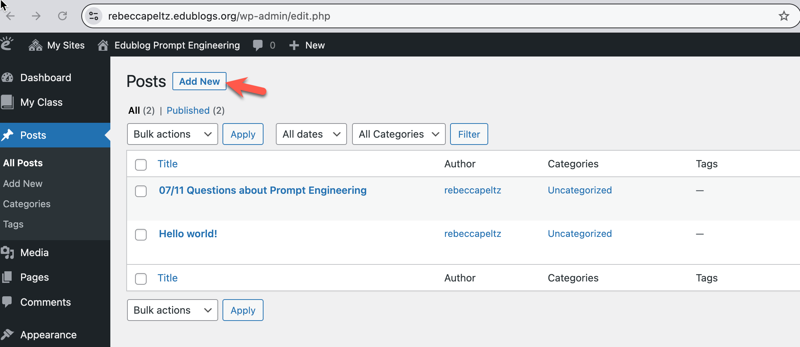<figcaption>
Click on Posts and see the button to Add New
</figcaption></figure>

2. Click on Add New to create a new post

<figure>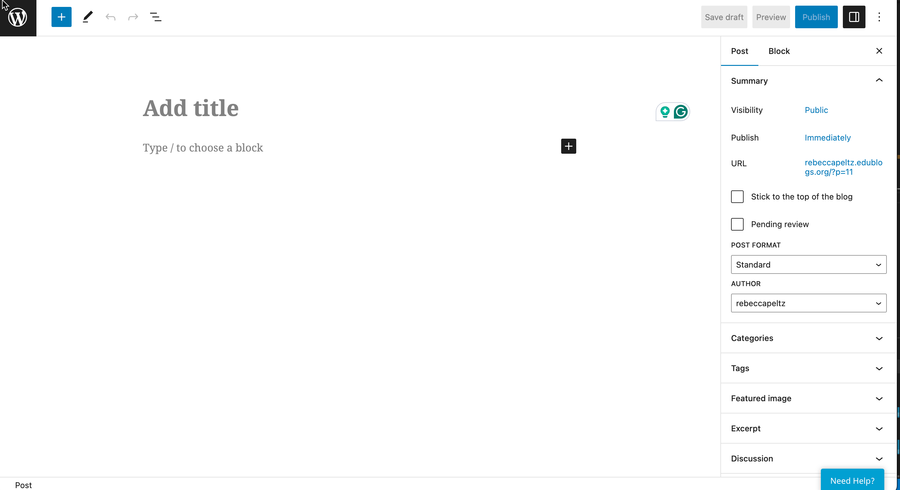<figcaption>
Create new post in Edublogs
</figcaption></figure>

3. Add text for the title: **Experiment with Edublogs**

<figure>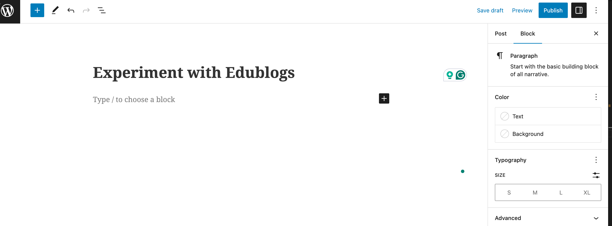<figcaption></figcaption></figure>

3. Navigate to [ChatGPT](https://chatgpt.com/)
4. Create a ChatGPT account using your email or a Google, Microsoft, or Apple account and login
5. From the ChatGPT web page, click on the Get Citation and then click on Copy to copy the source of your content into your clipboard.&#x20;

<figure><figcaption>
Start by copying the citation for your source into your clipboard
</figcaption></figure>

6. Paste the ChatGPT citation information into your Edublog post.

<figure><figcaption>
Add citation to blog
</figcaption></figure>

6. Type the following question into the ChatGPT **Message Input**:  _Create an illustration of  a chicken_

Add your question and text response to the Edublog post. Identify the text that was your question and the text that was ChatGPT's answer.

<figure>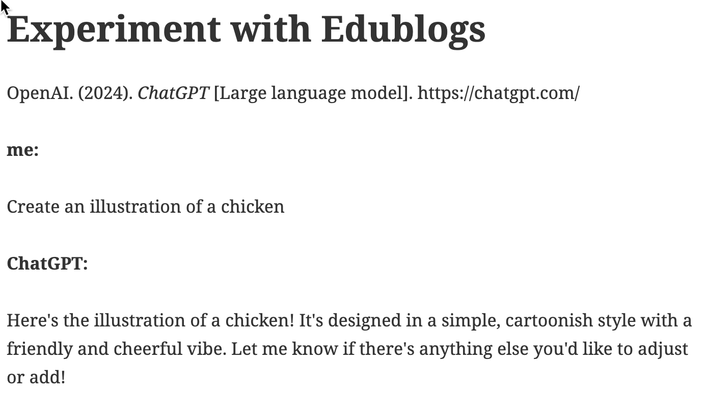<figcaption></figcaption></figure>

7. &#x20;If you have not used up your daily limit of ChatGPT-generated images, you should have an image of the illustrated chicken.  If you hover over the image, there is a download button. Click on it to download the image.  Make note of the name of the image you downloaded.  My sample image download name is:  _DALL·E 2024-08-13 16.09.20 - An illustration of a chicken in a simple, cartoonish style. The chicken should be standing on green grass with a blue sky background. It should have w.webp._ Notice the name of the downloaded file contains a lot of information about the request used by Chat GPT to create it.  Add this name to your notes in the blog.

<figure>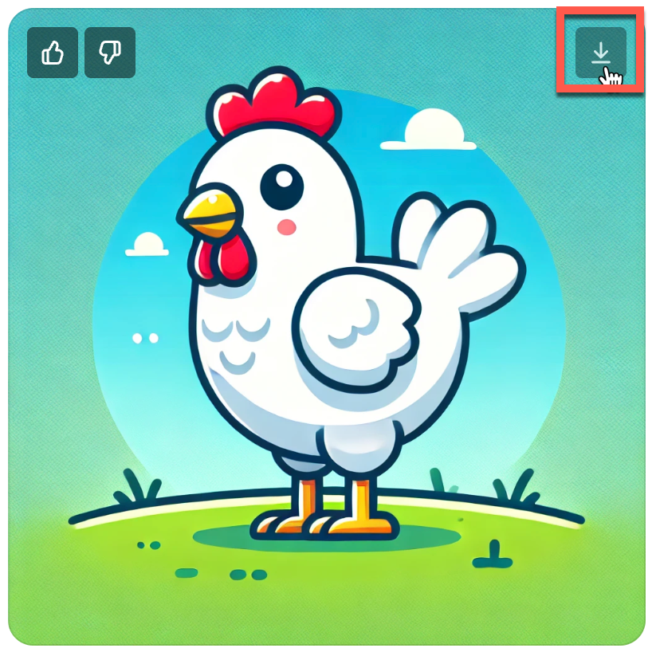<figcaption>
Download image created by ChatGPT
</figcaption></figure>

8. ,(Optional) You can add your image to Edublogs. Notice that the image file ends in **webp**. This format is unacceptable to Edublogs, but you can convert it using an online conversion tool. Navigate to [ezgif/webp-to-jpg](https://ezgif.com/webp-to-jpg).  Click on **Choose file** and select the file downloaded from ChatGPT.  Next, click on **Convert to JPG**. Finally, click on **Save.**  Now, you will have a file on your local drive with a **jpg** extension.

<figure>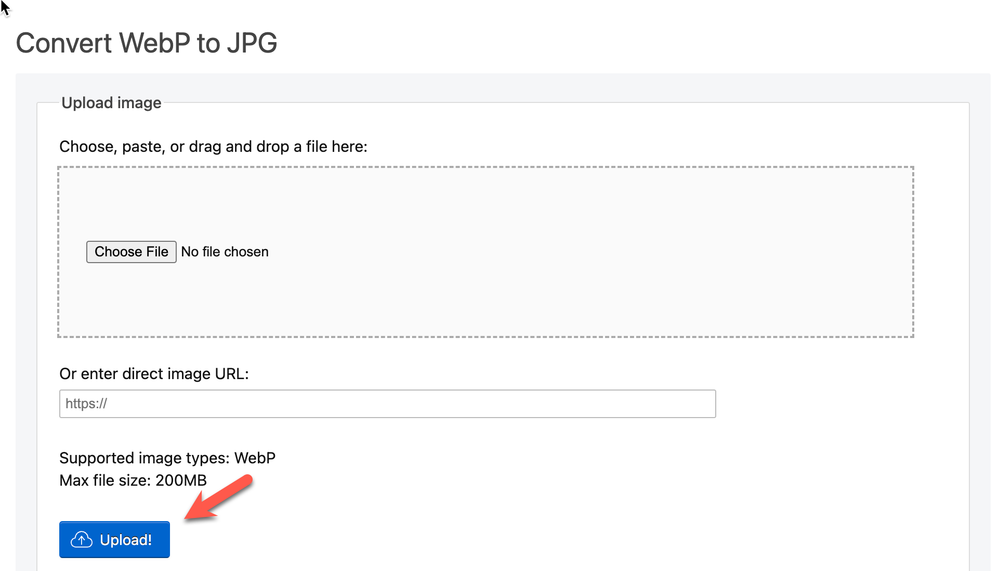<figcaption>
Click upload to upload file from ChatGPT
</figcaption></figure>

 

<figure>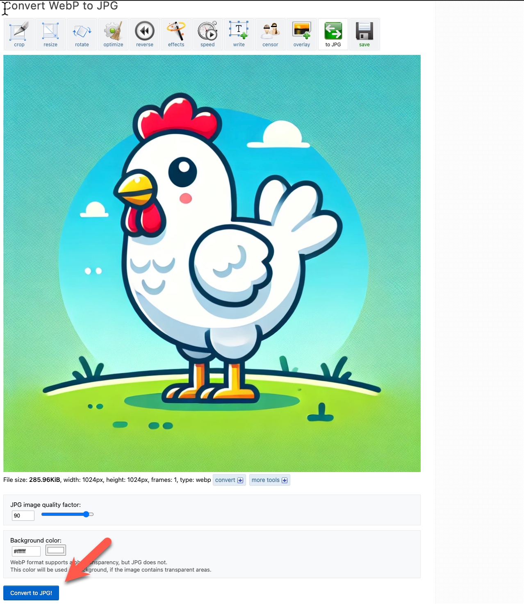<figcaption>
Click Convert to jpg
</figcaption></figure>

 

<figure>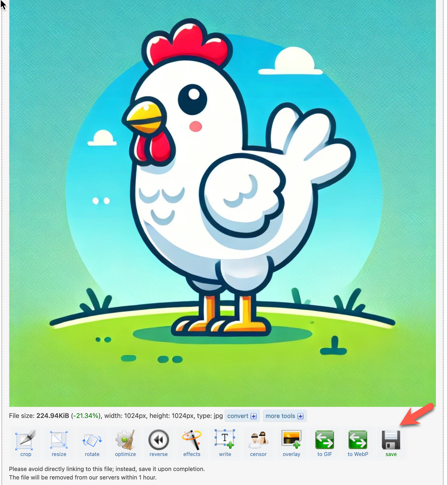<figcaption>
Click Save
</figcaption></figure>

Now that you have an image in the jpg format, you can add it to Edublogs.  On the Edublogs page,  enter a forward slash, **/**, and select **Image**. You'll see an upload file button.  Click on it and select the file with the jpg extension.&#x20;

<figure>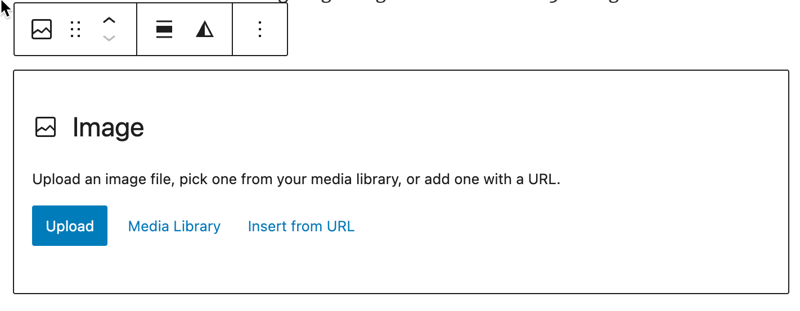<figcaption>
Upload an image to Edublogs
</figcaption></figure>

9. Save the draft and preview your blog post.

<figure>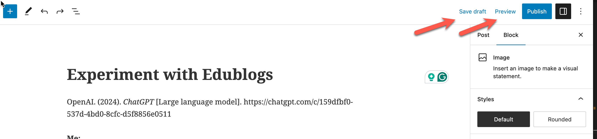<figcaption>
Save and Preview the post
</figcaption></figure>

10. Click on the Publish button to make the page available on the web.  The completed post will look like the image below (chicken image optional).

<figure>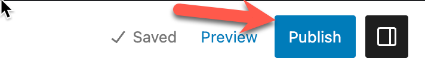<figcaption>
Publish the post
</figcaption></figure>

<figure>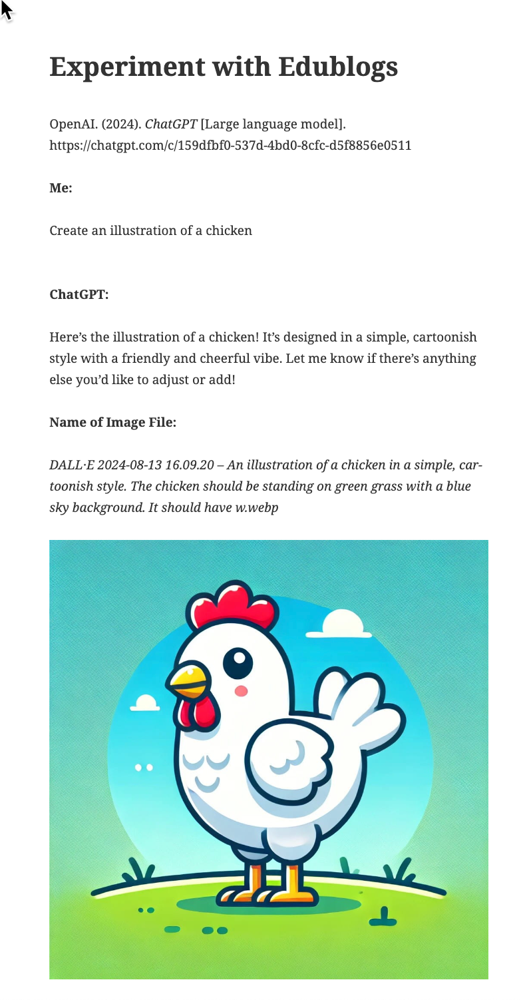<figcaption></figcaption></figure>

