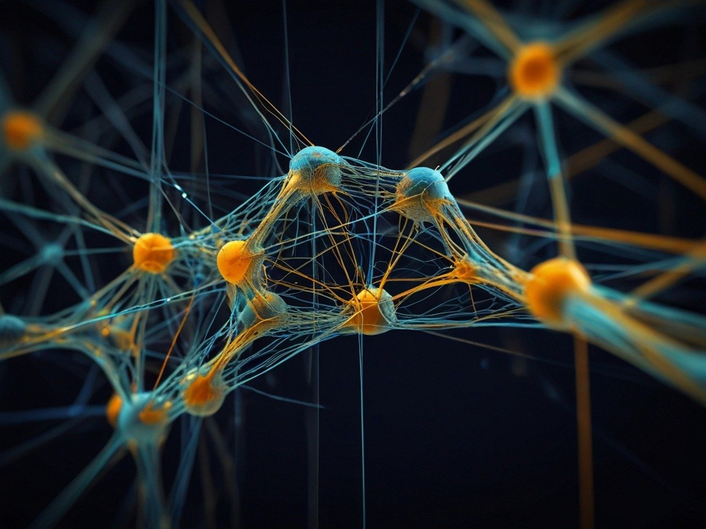

# Generative AI using LLM Models

<figure><figcaption>
Modeling Human Learning and Communication
</figcaption></figure>

Chances are you've used a search engine like Google.  You're interested in information about a specific topic, so you type that topic name into the Google search input and wait for Google to return a list of websites that might satisfy your interest.  Although the technology behind this is very different, the user experience for interacting with GAI may feel similar.  You'll provide a request prompt in the form of a question or a command, and after some processing, the GAI model will return content that fulfills your request.  Let's look at how the technology behind this program works.

### Large Language Models and Generative AI

&#x20;Multiple audiences want to understand how LLMs are built and used to create GAI. Many are interested in implementing the code to write an LLM. In this course, we are ultimately interested in interacting with Generative AI, not how to code it.  However, the more we understand how GAI is created, the better we'll appreciate what makes a good prompt.

Let's let Google Gemini describe how LLMs are built and used in GAI.  We'll ask it this question:

> How would you describe creating generative AI using LLms for non-programmers?

Now, let's see how Gemini responded:

> ### Creating Generative AI with LLMs: A Simple Explanation
>
> **Imagine teaching a child to write stories.** You start by reading them countless books. Over time, they learn about different characters, plots, and writing styles. Eventually, they can create their own stories based on what they've learned.
>
> **That's essentially what we do with Large Language Models (LLMs) to create Generative AI.**
>
> * **LLMs are like super-smart children:** They're fed massive amounts of text data - books, articles, code, and more.
> * **Learning to write:** As they process this information, they learn patterns, grammar, and how to structure different kinds of text.
> * **Creating something new:** Once trained, we can give the LLM a prompt (like "Write a story about a robot who wants to be a chef") and it uses its knowledge to generate new text.
>
> **So, creating Generative AI with LLMs is like training a super-intelligent writing assistant.** It's about feeding it lots of information, letting it learn, and then asking it to create something original based on what it's learned.

Gemini starts with a metaphor, reminding us how we teach children to write stories: We read them "countless books." After they've read many books, they start to see patterns, which they can then use to write their books.  Then we find out that LLMs are like "super-smart" children who can read many "books". This means they read a lot of data, including books, articles, and code.  They can then process this information in a way that allows them to share summaries using human language.&#x20;

### Artificial Neural Networks (ANNs)

Even though we won't be coding an LLM, we can look at the data flow through a neural network.  LLMs use AANs to process data.  The image below shows a human neural network.  Notice that the round element is a neuron, and the "stringy" elements attached are synapses.  Neurons send electrical impulses to other neurons via synapses.  When a neuron fires an impulse, there's a good chance that the connected neurons will also fire impulses.

<figure><figcaption>
Human neural network
</figcaption></figure>

The image below shows an ANN.  Data is input starting with the **input layer** on the left.  Lines simulate synapses.  They move data to **nodes,** which stimulate neurons.  Data is processed at each node in the hidden layer using an **activation function**.  Notice that each neuron sends data to the next neuron in the hidden layer.  The activation function is a decision-making construct determining how much data should be forwarded. When the processed data gets to the **output layer,** it is compared to the input, and if it doesn't match, backpropagation is sent in the opposite direction for reprocessing.  This forward and backward processing may be repeated many times until the error calculation shows that "what goes in is what comes out".

<figure><figcaption>
Artificial Neural network
</figcaption></figure>

These layers are what inspire the name **Deep Learning**. This procedure for processing data is called **training**, and the output is a trained model that can be prompted to share what it has learned.

### Models for Generating Text, Images, and Audio

AI training follows the flow described above, but different processes are required to generate text, images, video, and audio.  The input data, internal data representation, and output are very different from other types of GAI.   How data is represented for each media representation in the inner layer will change how the data is processed.

* **Text:** data is sequential and contains numbers
* **Image:**  data is spatial and includes arrays of pixels
* **Video:**  data takes into account time and space and is made up of frames
* **Audio:** like video, data takes into account time and is made up of waveforms

The next section will examine how to interact with different models.
