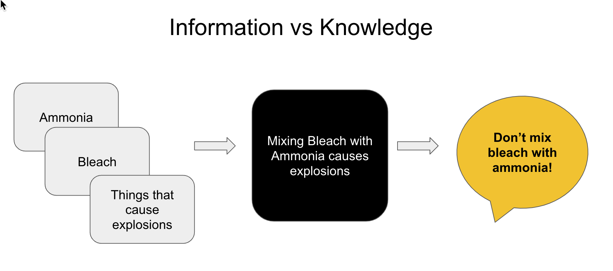
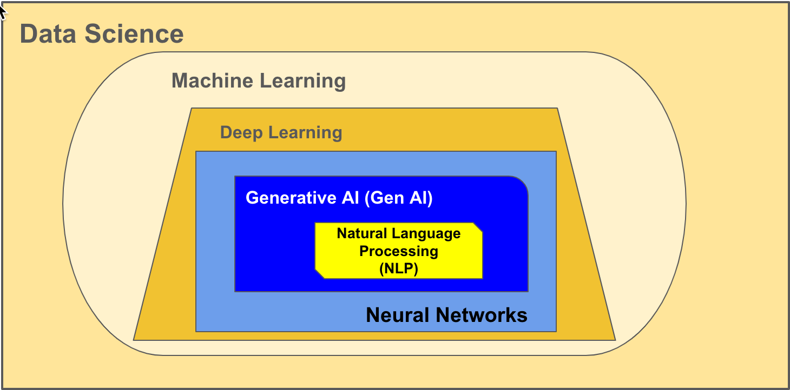
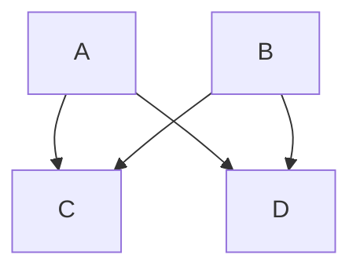
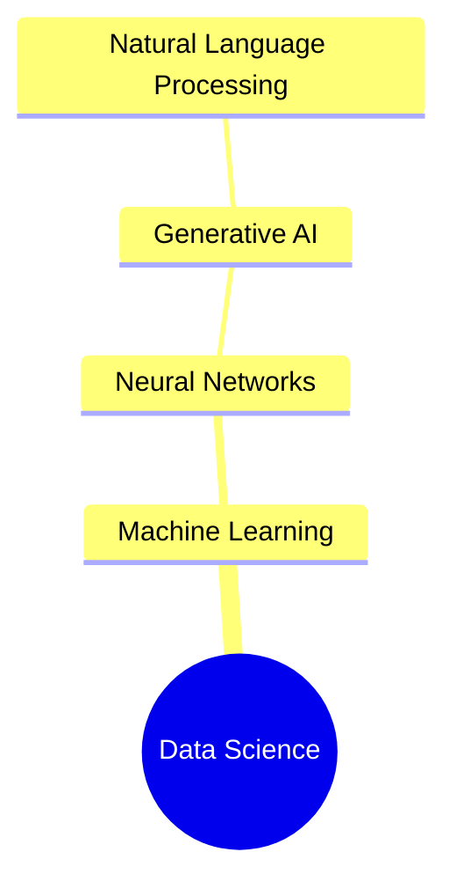

# What is AI?


Before diving into the mechanics of Artificial Intelligence, think about what intelligence means.  What is the value of intelligence? Is it an end in itself?

### Knowledge vs. Wisdom

In this course, a lot of what you learn about artificial intelligence is how to ask a better question and not stop at just one question.  The master and martyr for asking questions to better understand the world and its people is Socrates, who lived in Athens, Greece, 470-399 BC.   In modern education, we encourage self-reflection and critical thinking.  These are activities that involve asking questions.  As you develop your skills at eliciting information from artificial intelligence applications, you honor a long Western tradition known as the Socratic method. &#x20;

Artificial Intelligence (AI) is created by "reading" massive amounts of content curated from many resources.  AI is also trained, using pattern recognition, to parse the language you submit to it and collate a response in natural language.   The image below demonstrates how information is turned into knowledge.  It requires ingesting many sources, finding what connects them, and then communicating them in an understandable way.

<figure><figcaption><p>Creating knowledge from information</p></figcaption></figure>


Artificial intelligence can help you learn and communicate much about subjects you're interested in.  However, at this point, AI does not experience the world as we humans do.  This lack of physical experience, knowing pain and pleasure, separates it from us. The difference between knowledge and wisdom is the ability to experience the world. &#x20;

I read the following quote on Instagram from an Irish Rugby Player, Brian O'Driscoll, 2009 about knowledge and wisdom.  I thought it was clever.  Then, I asked an AI application about the quote.  It turns out that the quote originated from a British journalist, Miles Kington, in 2003.&#x20;

> Knowledge is knowing that a tomato is a fruit; wisdom is knowing not to put in into fruit salad.

Whether you agree that tomatoes belong in fruit salads or not, experience is the key to differentiating knowledge from wisdom.  AI will not give you the experience, but it will provide the knowledge that may lead you to test the experience.  Human wisdom is also not universal, as it relies on individual experience.  This is important because, as you will see, AI can be fallible, and the only way to know for yourself is to find a way to test it.

### Terminology

Artificial Intelligence is a term that covers many disciplines.  Everthing from self driving cars to movie recommendations use artificial intelligence.  In this course, we'll be focusing on Generative AI.  The image below shows the heirarchical relationship between disciplines under data science.   Notice that Natural Language Processing is a subset of Generative AI and that Generative AI is a subset of Neural Networks.

<figure><figcaption><p>Heirarchy of disciplines under data science</p></figcaption></figure>

While we'll be focusing on creating prompts for artificial intelligence that uses Generative AI and Natural Language Processing, it helps to see how these disciplines fit under the broader field of Data Science.

````mermaid

````




