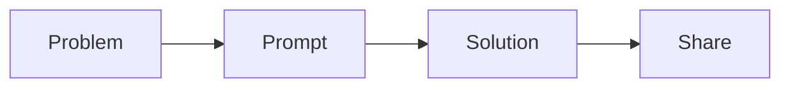

# Summary

<figure><figcaption></figcaption></figure>

The content in this eBook, **Using AI at Home and in the Workplace,** is made available to support a course of the same name. This course briefly introduces Artificial Intelligence as it stands in 2024. It is a rapidly evolving field of computing. The models, services, or online applications that work with them change daily.

Despite the changes, this course introduces the terminology and AI and how to incorporate what it offers into a problem-solving process. &#x20;

### Prompts

Working with AI calls upon the user to develop prompts that become the basis of a dialog between humans and machines—the more detailed and specific the prompt, the better the output.  The AI model is completely language-oriented; therefore, a human is most successful when the language used in the prompt is abundant and focused.

### Edublogs

Learning is enhanced by activity. This course involves creating prompts and digesting the content returned by the GenAI models. Edublogs is a free online blogging service for education. Students can use these blogs to capture both prompts and responses. Once blogging is mastered, students can start addressing problems by interacting with different models. The problem resolution experience can be captured in Edublogs.

### Multimodal GenAI

The course is focused on problem-solving using text-based GenAI. Some non-text-based AI services, including [Grammarly](https://app.grammarly.com/) and [Udio](https://www.udio.com/), are mentioned to help students appreciate the multiple types of services and content available online. &#x20;

### Sharing AI

It's challenging to think about solving problems through dialog without addressing some issues involved in sharing what has been learned. Below is a simple graph of this process.

Sharing content created by AI has challenges. While it's easy enough to copy/paste what has been learned from AI, sharing it could result in copyright violation.&#x20;

### Play With It

While this course is focused on solving problems that arise at work and home, it is also meant to teach students how to interact with AI and see its value. The best way to master Generative AI is to imagine an answer and create enough prompts to realize it. Think of the model as a friend who has read everything you never had time to read, and then play with this friend.

